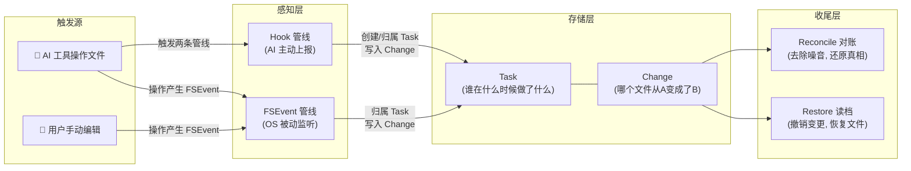
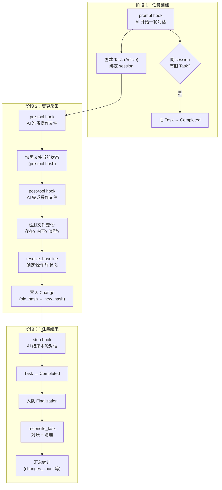
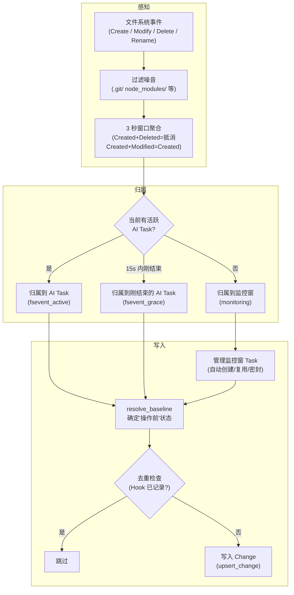
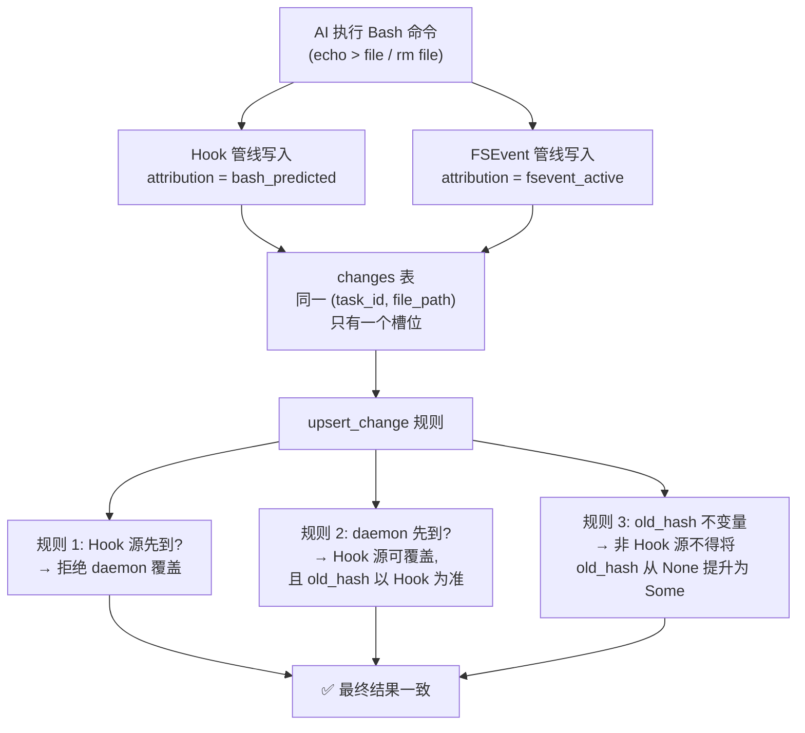
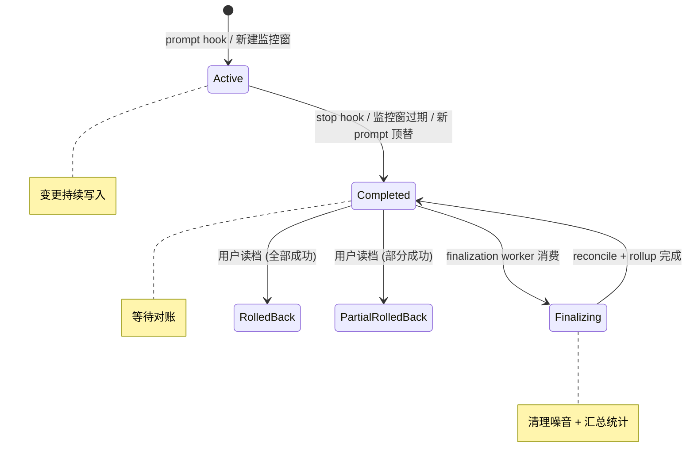
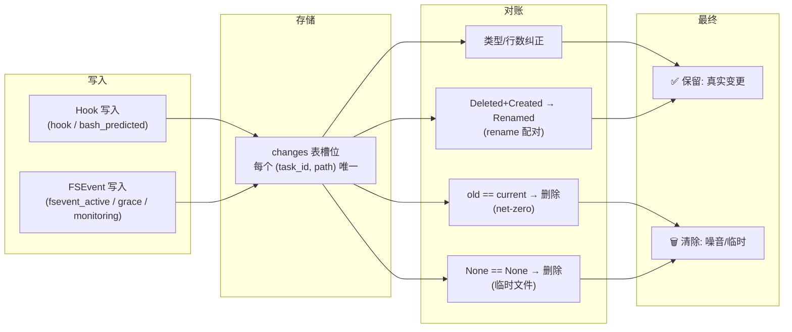
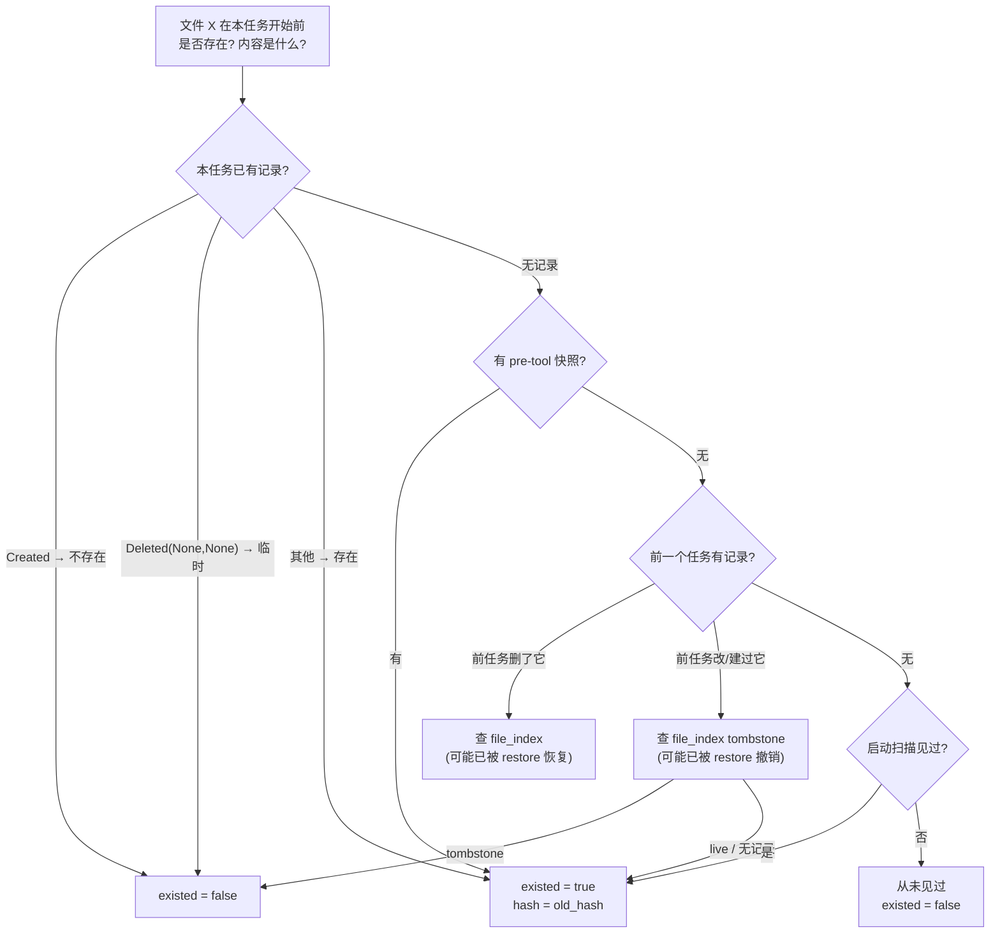
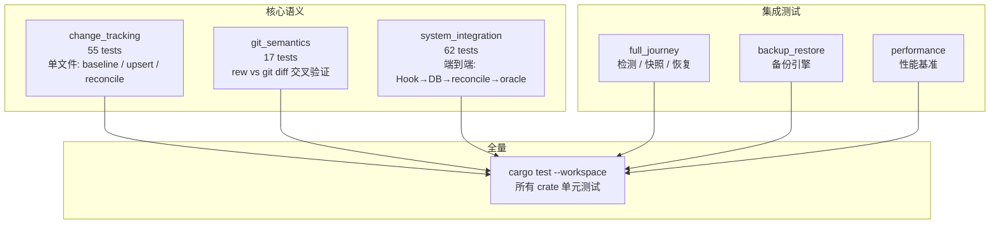

# rew 系统主流程图

## 一、全局视角：两条管线，一个归宿



---

## 二、Hook 管线：AI 任务的完整生命周期

> AI 工具通过 4 种 hook 事件主动上报，rew 据此管理 Task 的生死和 Change 的写入。



---

## 三、FSEvent 管线：文件监听的完整处理链

> 所有文件变更（无论 AI 还是手动）都会产生 OS 事件，rew 监听后走独立管线。



---

## 四、双管线交汇：同一文件的竞争写入

> AI 用 Bash 操作文件时，Hook 和 FSEvent 会同时为同一文件写入 Change，系统通过优先级机制保证一致性。



---

## 五、Task 的生与死



---

## 六、Change 的一生



---

## 七、Baseline：回答"操作前文件是什么样"

> 无论 Hook 还是 FSEvent，写入 Change 前都要确定 old_hash。Baseline 是共享的判定逻辑。



---

## 八、Restore 与 Baseline 的交互

> 读档操作（undo_task / undo_file / undo_directory）会改变文件系统状态，
> 但**不会删除**历史 change 记录。Baseline 通过 file_index 交叉校验感知 restore。

三种 restore 操作都通过 `apply_file_index_updates_after_restore` 更新 file_index：
- 文件被删除 → `mark_file_index_deleted`（tombstone: `exists_now=0`）
- 文件被恢复 → `upsert_live_file_index_entry`（live: `exists_now=1`）

Baseline Layer 3 在查到前序 task 的历史记录后，对称地检查 file_index：

| 历史记录类型 | file_index 状态 | Baseline 结果 |
|---|---|---|
| Deleted | live（restore 恢复了文件） | existed=true |
| Deleted | 无 live 行 | existed=false |
| Created/Modified | tombstone（restore 删除了文件） | existed=false |
| Created/Modified | live / 无记录 | existed=true |

---

## 九、测试体系

> 发布前通过 `scripts/test-all.sh` 执行全量回归，任意失败阻断打包。



**Oracle 验证**：`system_integration` 中的关键测试附带独立 oracle —— 在 task 开始前拍摄磁盘快照（path→SHA-256），task 结束后用 baseline→disk 差异计算 ground truth，与 rew 的 reconcile 输出比对。这与 `git_semantics` 用 `git diff --name-status` 做独立裁判的思路一致，避免测试自己验证自己。

---

## 十、一句话总结

```
AI 操作 → Hook 主动上报(管理 Task 生命周期 + 写入 Change)
         ↘
          ↘ 同时
         ↗
OS 监听 → FSEvent 被动捕获(归属到 Task + 写入 Change)
                    ↓
              resolve_baseline (确定操作前状态, 含 restore 交叉校验)
                    ↓
              upsert_change (优先级保护, 去重)
                    ↓
              reconcile_task (对账: 去噪音, 配重命名)
                    ↓
              最终结果: 每个文件一条干净的 Change 记录
```
